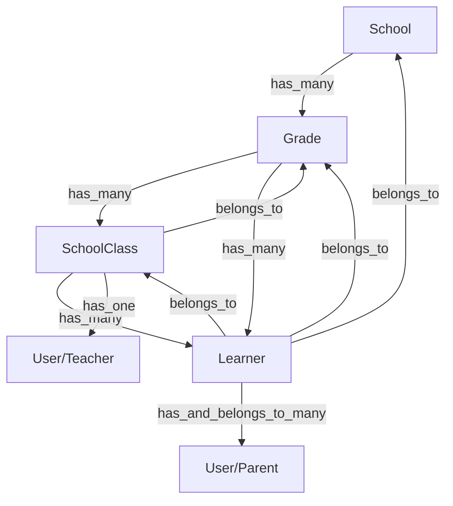

# Agent Guidelines: sho_backend_v2

This document provides architectural context and operational rules for AI agents working on the `sho_backend_v2` project.

## Project Overview
A Rails 8 API-only backend using MongoDB (via Mongoid) for school management, featuring a multi-tier hierarchy: **School > Grade > SchoolClass > Learner**.

### Architecture Diagram

---

## Core Operational Rules

### 1. Mongoid Field Mapping & Physical Database
*   **CamelCase Keys**: Production data often uses camelCase keys (e.g., `firstName`, `accessionNumber`). Always map these using the `as:` option in Mongoid.
    *   *Correct*: `field :firstName, as: :first_name, type: String`
*   **Explicit Foreign Keys**: Use `foreign_key` explicitly in associations to match existing data keys like `gradeId`.
    *   *Correct*: `belongs_to :grade, foreign_key: :gradeId`
*   **Raw Queries**: Use `Model.collection.find` when querying fields stored as Strings that Mongoid might incorrectly cast to `BSON::ObjectId`.

### 2. Identifier Resolution (The "Resilient Lookup" Pattern)
*   Support lookup by **BSON ID**, **Slug**, or **Hyphenated Name**.
*   When resolving from a URL slug:
    1.  Convert hyphens to spaces (`gsub('-', ' ')`).
    2.  Perform a case-insensitive regex search (`/^...$/i`).
*   Example: `find_school_by_id_or_slug` in `SchoolResolver`.

### 3. BSON Guardrails & API Resilience
*   **Validate IDs**: Use `BSON::ObjectId.legal?(id)` before querying.
*   **Rescue Blocks**: Wrap controller actions in `begin...rescue` blocks to ensure JSON error responses. Avoid Rails rendering HTML error templates (like web-console) in development.
*   **Error Handling**: Rescue `BSON::Error::InvalidObjectId`, `Mongoid::Errors::DocumentNotFound`, and `Mongoid::Errors::InvalidFind`.

### 4. Controller & Routing Standards
*   **Filename Exceptions**: Note that `app/controllers/api/v1/schoolsController.rb` and `usersController.rb` use camelCase filenames. Maintain this naming.
*   **Parameter Support**: Support both `snake_case` and `camelCase` parameters in API payloads (e.g., `school_id` and `schoolId`).
*   **Namespace Hierarchy**: Preference is given to nested controllers (e.g., `Api::V1::Grades::LearnersController`) for grade-specific listings.
*   **Shallow vs. Nested Routes**: Support both shallow (e.g., `/api/v1/classes/:id`) and nested (e.g., `/api/v1/schools/:s_id/grades/:g_id/classes/:id`) routing for frontend compatibility. Controllers should infer context (School, Grade) from the class ID if hierarchical params are missing.

### 5. Data Integrity & Performance
*   **Hash Dirty Tracking**: When updating `Hash` fields (like `subject_teacher_ids`), call `.dup` on the hash before modification to ensure Mongoid tracks the change.
*   **Atomic Operations**: Use MongoDB atomic operators (`$pull`, `$addToSet`) for array modifications (e.g., `learner_ids` in `SchoolClass`) to prevent race conditions.
*   **N+1 Prevention**: Bulk pre-fetch associated records (e.g., `User` records for teachers) using `index_by` or `bson_ids` helpers.

---

## Tech Stack Summary
*   **Framework**: Rails 8.0.2 (API Mode)
*   **Database**: MongoDB via Mongoid (ActiveRecord is disabled)
*   **Authentication**: Auth0 (via `Secured` concern and JWT)
*   **Serialization**: ActiveModelSerializers (AMS)
*   **Performance**: Bootsnap, Thruster
*   **CORS**: Configured for wildcard origins in `config/initializers/cors.rb`
