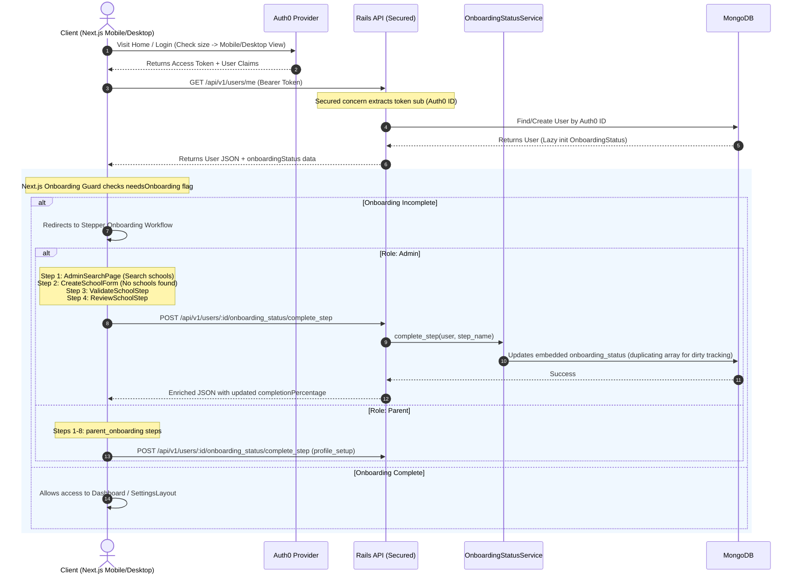

# Branch Reconciliation & Architecture Baseline Report (Phase 1)

This report establishes the baseline architecture, identifies pre-existing structural issues, maps out the authentication/onboarding flows, and provides actionable recommendations to align the production branch (`parent-onboarding-complete-step`) and the local development branch (`silence-gem-backtraces-10625524574831857542`) before launching Phase 2.

No application code or tests have been modified during this phase.

---

## 1. Branch Diff Summary

An exhaustive file-by-file and logical comparison was performed between the stable production branch (`origin/parent-onboarding-complete-step`) and the active local development branch (`silence-gem-backtraces-10625524574831857542`).

### 1.1. Core Architectural Shift: The School Hierarchy
The local development branch introduces a major multi-tier school management hierarchy: **School ➔ Grade ➔ SchoolClass ➔ Learner**.
*   **Production Branch**: Stored learners directly under `Grade` models with standard attributes (like `capacity`, `fees`, `min_age`, `max_age`, `academic_year_start/end`) residing on the `Grade` model itself.
*   **Local Development Branch**: Drastically simplifies the `Grade` model to just 4 fields (`name`, `level`, `description`, `order`). It delegates classroom-specific features (such as `capacity`, `class_teacher_id`, `subject_teacher_ids`, and `learner_ids`) to a brand-new model, **`SchoolClass`**. Learners are assigned directly to a `SchoolClass` within a `Grade`.

---

### 1.2. File-by-File Changes, Source of Errors, and Legitimate Progress

| File Path | Change Status | Type of Change / Detailed Analysis | Legitimate Progress? | Source of Errors? |
| :--- | :--- | :--- | :--- | :--- |
| **`app/controllers/api/auth_controller.rb`** | **NEW** (Local Only) | Defines endpoints `/api/auth/login` and `/api/auth/me`. Contains `skip_before_action :verify_authenticity_token`. | **Partial** (Auth Interceptor placeholder) | **YES (CRITICAL)**: Inherits from `ApplicationController` (`ActionController::API`), which does not include forgery protection. Calling `skip_before_action` on a non-existent callback throws `ArgumentError: Before process_action callback :verify_authenticity_token has not been defined` during Zeitwerk/boot. |
| **`app/models/school_class.rb`** | **NEW** (Local Only) | Introduces the class-tier unit model (e.g. "9A") with `capacity` (default 40), `class_teacher_id`, `subject_teacher_ids` (Hash), and `learner_ids` (Array of ObjectIds). | **YES**: Necessary for the nesting hierarchy. | No |
| **`app/controllers/api/v1/classes_controller.rb`** | **NEW** (Local Only) | Standard CRUD actions for class management and advanced operations like `assign_teacher` and `move_learner`. | **YES**: Exposes the classroom management endpoints. | No |
| **`config/routes.rb`** | **Modified** | Extends routes with the `SchoolClass` endpoints, nested layouts, and fallback routes. Reorganizes block structures into strict `only: [...]` declarations. | **YES**: Aligns routing with the hierarchy. | **YES (CRITICAL)**: Outlines backward-compatibility path routes pointing to `users#show_by_path`, `users#schools_by_path`, and `users#onboarding_status_by_path` which do not exist in the local `UsersController`! |
| **`app/controllers/api/v1/usersController.rb`** | **Modified** | Simplifies user operations but deletes the path-based compatibility methods (`show_by_path`, `schools_by_path`, `onboarding_status_by_path`). Retains fallback query/token decoding logic. | **NO (Regression)**: Deleting actions while keeping their routes caused immediate `AbstractController::ActionNotFound (404)` integration test and production crash failures. | **YES (CRITICAL)**: Deletion of action methods triggers crashes on path-based requests. |
| **`app/services/user_services/create_user_service.rb`** | **Modified** | Production branch contains an extremely mature, robust service supporting pre-fixed `auth0_id` matching, standard provider fallbacks (`google-oauth2`, `facebook`), email fallback finders, and input sanitization. The local branch simplified this to a basic `Struct`-based `find_or_initialize_by` call. | **NO (Regression)**: Slashes the safety and flexibility of the registration system. | No |
| **`app/models/learner.rb`** | **Modified** | production stores `status` and `gender` as **Integers** with scope mappings. Local branch maps these fields directly to camelCase physical DB keys via aliases, introduces new snapshot fields (like `schoolName`, `province`, `telEmergency`), but stores `status` and `gender` as **Strings** ("active", "M", "F"). | **YES** on field-mapping and snapshotting; **NO** on type-change risks. | **YES (RISK)**: Modifying types of load-bearing fields without a data migration or dual-type fallback causes silent validation and retrieval failures on existing production records. |
| **`app/models/grade.rb`** | **Modified** | production uses a feature-heavy model with academic years, fees, and capacities. Local branch strips this down to 4 basic fields, delegating all academic management to `SchoolClass`. | **YES**: Vital structural simplification for hierarchy. | No |
| **`app/models/learner_invitation.rb`** & **`app/models/teacher_invitation.rb`** | **Modified** | production utilizes descriptive models tracking South African phone validations, magic-link helpers, and base64 tokens. Local branch completely rewrites both into simplified, integer-status-based models. | **NO (Regression)**: Simplifies them to the point of breaking legacy phone-based WhatsApp invitations. | No |
| **`app/models/invitation.rb`** | **Identical** | Unified invitation model using `SecureRandom.urlsafe_base64(32)` tokens and magic links. | **YES**: Excellent forward progress for unified invitations. | No |
| **`app/services/user_services/invitation_service.rb`** | **Modified** | production targets `LearnerInvitation` or `TeacherInvitation` based on roles. Local branch targets the new unified `Invitation` model. | **YES**: Aligns with the unified invitation vision. | No |
| **`app/models/user.rb`** | **Modified** | Maps `onboarding_completed` and `onboarding_progress` and includes correct BSON error rescues. Local branch removes `phone` and `phone_number` fields. | **YES** on BSON fixes; **NO** on field deletions. | No |
| **`app/models/school.rb`** | **Modified** | production contains simplified indexes. Local branch configures explicit, named index structures, unique validations on `schoolEmail`, and association overrides. | **YES**: Optimizes school querying. | No |
| **`app/controllers/application_controller.rb`** | **Modified** | Extends unexpected API crash handlers to return clean JSON errors via `BacktraceCleanerUtil`. | **YES**: Essential crash resilience. | No |
| **`app/lib/backtrace_cleaner_util.rb`** | **NEW** (Local Only) | Cleans framework-level noise from error traces. | **YES**: Enhances logger readability. | No |

---

## 2. Known System Constraints (Read-Only)

The backend has inherited or developed a list of load-bearing system constraints that any future code (including Phase 2) must respect:

### 2.1. camelCase Database vs. snake_case Ruby Field Mismatches
*   **The Issue**: MongoDB physical collections contain camelCase keys (e.g. `firstName`, `lastName`, `accessionNumber`, `gradeId`). Standard Mongoid queries against snake_case symbols (like `where(first_name: ...)` or `where(grade_id: ...)`) silently return zero results or crash.
*   **Workaround**: Ensure physical field definitions are mapped exactly using `as:` options:
    ```ruby
    field :firstName, as: :first_name, type: String
    field :accessionNumber, as: :accession_number, type: String
    ```
*   **Association Key Traps**: Associations must explicitly declare `foreign_key` to avoid Mongoid guessing based on the standard class name (which generates BSON object ID casting errors when matched against string keys):
    ```ruby
    belongs_to :grade, class_name: 'Grade', foreign_key: :gradeId
    ```

### 2.2. Resilient Identifier Lookup (Workaround Pattern)
*   **The Issue**: Frontend clients pass BSON ObjectIds, URL-slugs, or hyphenated names as route parameters. Standard `Model.find` fails when passed non-BSON strings.
*   **The Pattern**: `resolve_school_id` resolves context flexibly by converting hyphens back to spaces (`gsub('-', ' ')`) and running regex pattern matching directly via `School.collection.find` (raw collection queries bypass relational type-casting traps):
    ```ruby
    # Raw collection queries are required when querying ID fields stored as Strings
    School.collection.find(
      "$or" => [
        { "schoolName" => name_pattern },
        { "school_name" => name_pattern },
        { "name" => name_pattern }
      ]
    ).first
    ```

### 2.3. BSON::ObjectId::Invalid NameError Crash
*   **The Issue**: Under modern BSON gem versions (BSON v5+) utilized in Rails 8.0.2 / Mongoid 9.0.6, the constant `BSON::ObjectId::Invalid` has been **removed**. Calling/rescuing it throws a `NameError: uninitialized constant BSON::ObjectId::Invalid` instead of intercepting the exception, resulting in 500 errors.
*   **The Rule**: Always catch `BSON::Error::InvalidObjectId`, `Mongoid::Errors::DocumentNotFound`, and `Mongoid::Errors::InvalidFind` instead.

### 2.4. after_create_commit Callback Crash
*   **The Issue**: `after_create_commit` and `after_update_commit` are Active Record-specific callbacks. Mongoid does not natively support transaction commit lifecycle hooks unless explicitly configured with Active Record transactions. Specifying symbol callbacks with `after_create_commit` in a Mongoid model causes unhandled runtime crashes during instantiation.
*   **The Rule**: Restrict callbacks to standard Mongoid hooks like `after_create` or `after_save`.

### 2.5. Mongoid Dirty Tracking on Hashes & Arrays
*   **The Issue**: Editing elements inside a Mongoid `Hash` or `Array` field directly (e.g., `user.onboarding_status.client_metadata["foo"] = "bar"`) does **not** trigger Mongoid's dirty tracking. As a result, saving the parent record silently discards updates.
*   **The Rule**: Always call `.dup` or reassign the field to trigger persistence:
    ```ruby
    meta = (onboarding_status.client_metadata || {}).dup
    meta["step_completed_at"] = Time.current.iso8601
    onboarding_status.client_metadata = meta
    ```

### 2.6. Mongoid Criteria Method Chaining Constraint
*   **The Issue**: Calling `.compact` directly on a `Mongoid::Criteria` object immediately executes the underlying MongoDB query and returns a Ruby `Array`, destroying the ability to chain standard lazy querying methods like `.skip` or `.limit`.
*   **The Rule**: Handle optional parameters by filtering a criteria array and splatting it into `any_of` (e.g., `any_of(*criteria_array.compact)`).

---

## 3. Existing Auth / Onboarding Flow

### 3.1. End-to-End Flow Diagram (Frontend ➔ Backend)



---

### 3.2. Detailed Onboarding Architecture

#### User Roles Generalization
While the onboarding stepper (Step 1: Search School, Step 2: Create School, Step 3: Validate, Step 4: Review) is primarily utilized by **Admin** users, other user roles (Parents, Teachers, Learners, Principals) share the identical backend onboarding model structure.
Specifically, `OnboardingStatus` tracks progress by defining static arrays for different roles:
*   `ADMIN_STEPS`: `['create_grades', 'upload_learners', 'send_invites', 'admin_onboarding']` (4 steps)
*   `PARENT_STEPS`: `['profile_setup', 'link_learner', 'pay_deposit', 'parent_onboarding']` (8 total steps in transition)
*   `GUEST_STEPS`: `['guest_onboarding']` (1 step)

#### Onboarding Status Location
The onboarding status lives inside an **embedded document** on the `User` model (`embeds_one :onboarding_status`).
To ensure fast querying and filtering of users, the `User` model also exposes **denormalized fields**:
*   `onboarding_completed` (Boolean)
*   `onboarding_progress` (Float)

These fields are synchronized automatically whenever the embedded onboarding document is saved via an `after_save :sync_to_user` callback on the `OnboardingStatus` model:
```ruby
def sync_to_user
  user.set(
    onboarding_completed: all_steps_completed?,
    onboarding_progress: completion_percentage
  )
end
```
*To guarantee embedded lifecycle callbacks fire reliably, you must save the embedded document directly (e.g. `@user.onboarding_status.save!`) instead of relying solely on saving the parent document.*

---

### 3.3. Gap Analysis: Frontend vs. Backend Status Synchronicity

There are three major gaps between the frontend navigation and the current Ruby on Rails source of truth:

1.  **Missing Routing Compatibility**:
    The Next.js frontend performs path-based lookups to fetch status: `/api/v1/users/:auth0_id/onboarding_status`. On the backend, `config/routes.rb` maps this route to `onboarding_status_by_path`. However, the local branch deleted this method from `UsersController`, causing standard frontend requests to fail with a **404 ActionNotFound** crash.
2.  **Lack of Cohesive "Onboarding Guard" enforcement**:
    If a user attempts to bypass the onboarding flow by entering dashboard URLs, the frontend relies on client-side state flags to trigger redirects. The RoR backend does **not** enforce global onboarding interceptors at the API controller layer (such as rejecting non-onboarding requests with `403 Forbidden` if onboarding is incomplete), presenting a security risk.
3.  **Role Synchronization Delay**:
    When a user accepts an invitation in Phase 2, their role changes (e.g., from `guest` to `parent`). The `OnboardingStatus` role step lists are calculated dynamically. If the `roles` field on the parent user model is updated, the embedded `OnboardingStatus` needs to be forcefully re-initialized or synced (`reset!`), otherwise progress metrics will map to incorrect step requirements.

---

### 3.4. Existing Service Pattern: `app/services/user_services/`
The codebase organizes user operations using service objects to keep controllers lean. This established convention must be respected during Phase 2:
*   **Structure**: Services are initialized with parameters and execute their core routine in a `call` method.
*   **Result Pattern**: They return an operational `Result` object containing `success?`, `errors`, and the target payload.
*   **Action Plan for Phase 2**: Any invitation-acceptance business logic (e.g. creating the parent profile, linking learners, updating role fields) must be encapsulated in new service classes under `app/services/user_services/` (such as `UserServices::AcceptInvitationService`) rather than bloated inside controllers.

---

## 4. Recommendations Feeding into Phase 2

Before beginning Phase 2 (Learner Invitation System), the following alignment and reconciliation actions must be carried out:

### 4.1. Reconciled Branch Target State

1.  **Resolve the Zeitwerk / Boot Crash**:
    *   Modify `app/controllers/api/auth_controller.rb` to remove `skip_before_action :verify_authenticity_token` entirely, as API-mode controllers do not register or require request forgery protection.
2.  **Restore Deprecated Path Lookups**:
    *   Either restore `show_by_path`, `schools_by_path`, and `onboarding_status_by_path` methods in `UsersController`, or update `config/routes.rb` to forward these requests directly to the standard actions by converting path tokens to query parameters dynamically.
3.  **Standardize Learner `gender` and `status` Types**:
    *   *Critical Discrepancy*: Production branch expects `Integer` codes for gender/status. Local branch expects `String` codes.
    *   *Solution*: Align models to support both formats dynamically (e.g. map String codes to Integers when writing, or handle dual-type lookups) to prevent data corruption when deployed against existing production records.
4.  **Preserve Legitimate Local Progress**:
    *   Retain the simplified `Grade` model and the nested `SchoolClass` hierarchy.
    *   Retain the clean backtrace logging and BSON error rescues (`BSON::Error::InvalidObjectId`) implemented across controllers.
    *   Retain the unified `Invitation` model.
5.  **Restore Production `CreateUserService`**:
    *   Keep the highly resilient user creation logic from production (which supports alternative Auth0 prefixes and email fallbacks) but update it with the BSON error rescues implemented in local development.

---

### 4.2. Open Questions for Kagiso (Pre-Phase 2)

Before scoping the Phase 2 implementation, please clarify:
1.  **Seeding/Migration**: Are existing parent users in production already seeded with an `onboarding_status` embedded document, or should Phase 2 include an automated backfill/migration task to initialize statuses for older users?
2.  **Invitation Class Deprecation**: Should the legacy `LearnerInvitation` and `TeacherInvitation` models be completely removed in favor of the new unified `Invitation` model, or do we need to maintain backward compatibility with old pending tokens in the database?
3.  **Gender/Status Data Type**: Which data type (Integer vs. String) is the officially approved standard for `Learner`'s status and gender fields going forward?

---

### 4.3. Suggestion for AI Prompt: Frontend (Next.js) CRM Work

If you are running an AI session to implement the frontend features on your CRM branch (`feature/learner-invitation-crm-6860401472260020326`), you can use the following highly detailed system prompt:

```text
You are an expert Next.js frontend engineer assisting with the School Head Office invitations module.
The goal is to implement the Learner Invitation CRM and acceptance flows on the branch `feature/learner-invitation-crm-6860401472260020326` under the repository `https://github.com/kayjeee/SchoolHeadOfffice_invitations`.

Please respect the following constraints and context:
1. Routing: The Next.js client uses Auth0 for authentication. Upon login, the system checks the user's `needsOnboarding` and `onboardingStatus.onboardingCompleted` flags returned by `GET /api/v1/users/me` or `GET /api/v1/users/:auth0_id`.
2. Onboarding Stepper: For Parent accounts, there are up to 8 onboarding steps. The UI should render an OnboardingGuard that redirects incomplete parent setups to `/onboarding` until onboardingCompleted becomes true.
3. API Alignment: Ensure all outgoing network payloads support both snake_case and camelCase parameters (e.g., `school_id` and `schoolId`, `learner_id` and `learnerId`).
4. Invitation Form: Implement a CRM form to send out single or bulk parent invitations. The payload should target `POST /api/v1/invitations` with:
   - `phone_number`: South African format starting with '27' (e.g., 27XXXXXXXXX)
   - `school_id`: MongoDB ObjectId string
   - `grade_id`: MongoDB ObjectId string
   - `role`: "parent"
   - `parent_name`: String
   - `invited_via`: "whatsapp" | "sms"
5. Magic Links: The backend generates magic links with query strings like `?token=abc123xyz&school=Far+North+Secondary`. The frontend must handle this route (e.g., `/parent` or `/onboarding/accept`), extract the query parameters, display the school name, and make an API call to verify the token details via `GET /api/v1/invitations/:token/verify_with_details` or `POST /api/v1/invitations/verify` before prompting the user to sign up.

Please write clean React/Next.js components, hooks for API querying, and route managers. Avoid modifying backend API configuration.
```
