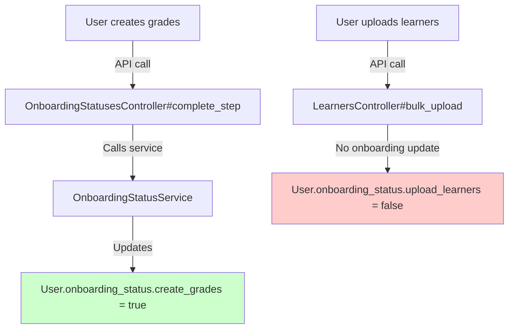
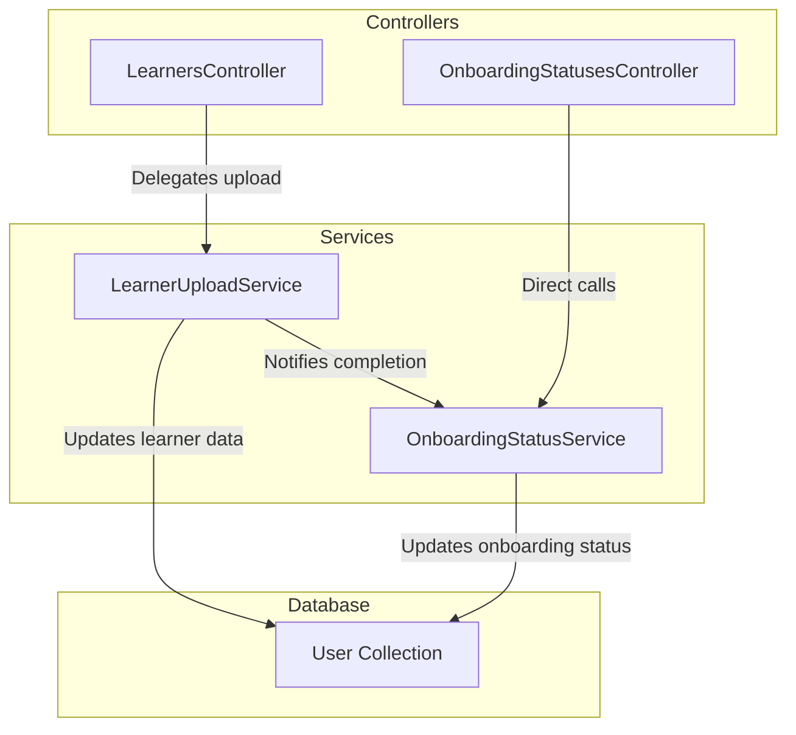
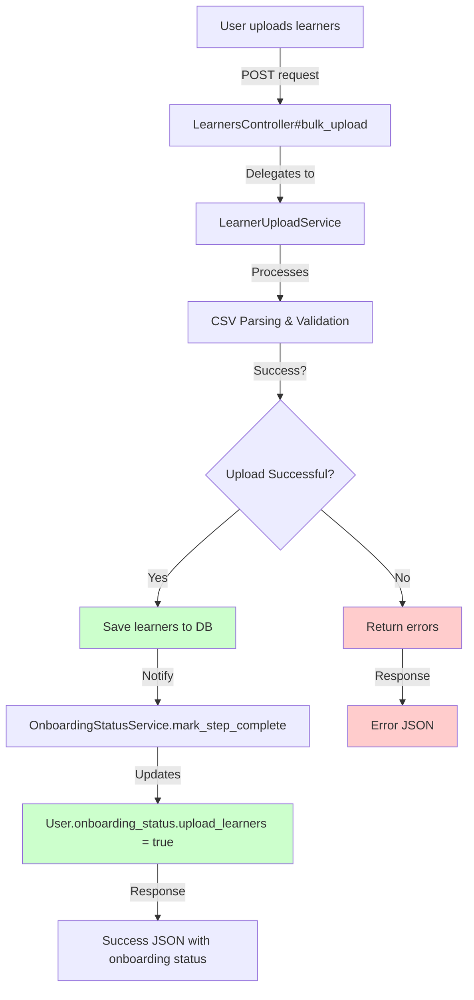
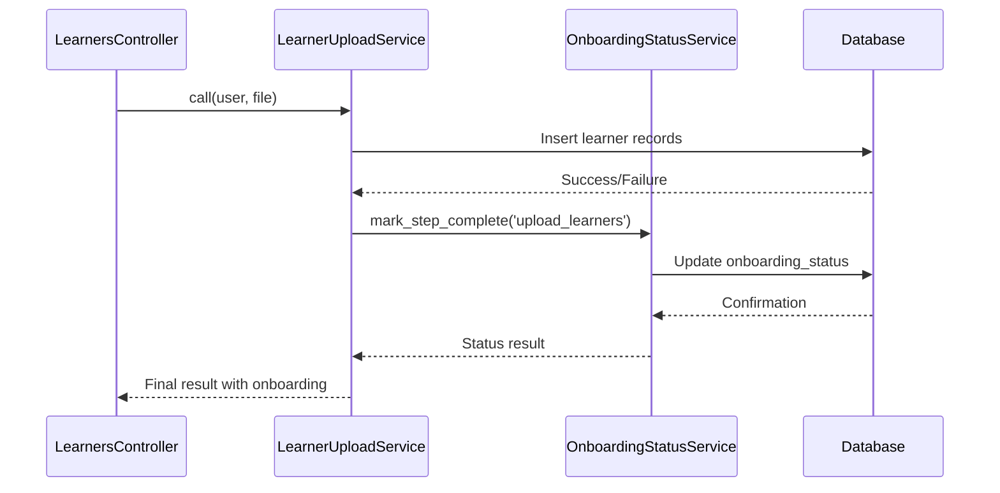
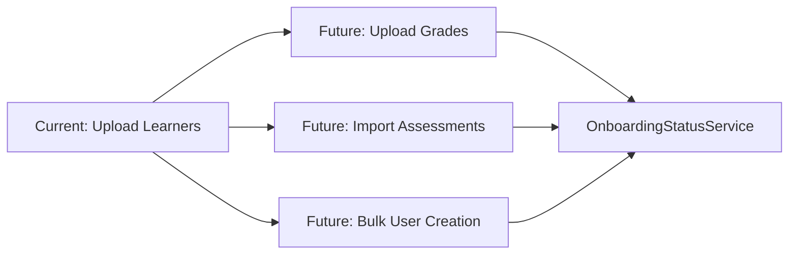

# Onboarding Status Plan Overview

## 1. Controller Summary

The `OnboardingStatusesController` manages user onboarding progress within the User collection.

### Key Actions

| Action | Endpoint | Purpose | Updates User? |
|--------|----------|---------|---------------|
| `show` | `GET /users/:user_id/onboarding_status` | Fetch current onboarding status | ❌ No changes |
| `update` | `PATCH /users/:user_id/onboarding_status` | Generic update to onboarding fields | ✅ Uses `$set` on provided params |
| `complete_step` | `POST /users/:user_id/onboarding_status/complete_step` | Mark step as completed | ✅ Delegates to OnboardingStatusService |
| `skip_step` | `POST /users/:user_id/onboarding_status/skip_step` | Add step to skipped array | ✅ Uses `$push` on skipped_steps |
| `reset` | `POST /users/:user_id/onboarding_status/reset` | Clear entire onboarding status | ✅ Uses `$set` |

## 2. Current Problem



**Issue**: Learner upload doesn't trigger onboarding status updates, leaving `upload_learners` as `false`.

## 3. Recommended Solution Architecture

### Service Separation Strategy

Instead of one shared onboarding service, we'll create dedicated services that communicate:



## 4. Implementation Plan

### Step 1: Create LearnerUploadService

```ruby
# app/services/learner_upload_service.rb
class LearnerUploadService
  def initialize(user, file_or_data)
    @user = user
    @file_or_data = file_or_data
  end

  def call
    # Process learner upload logic
    result = process_upload
    
    # Notify onboarding service on success
    if result[:success]
      OnboardingStatusService.mark_step_complete(@user, 'upload_learners')
    end
    
    result
  end

  private

  def process_upload
    # Your existing upload logic here
    # CSV parsing, validation, database inserts, etc.
  end
end
```

### Step 2: Update LearnersController

```ruby
# app/controllers/api/v1/learners_controller.rb
class Api::V1::LearnersController < ApplicationController
  def bulk_upload
    service = LearnerUploadService.new(@user, params[:file])
    result = service.call
    
    if result[:success]
      render json: { 
        success: true, 
        message: "Learners uploaded successfully",
        data: result[:data]
      }
    else
      render json: { 
        success: false, 
        errors: result[:errors] 
      }, status: :unprocessable_entity
    end
  end
end
```

### Step 3: Enhanced OnboardingStatusService

```ruby
# app/services/onboarding_status_service.rb
class OnboardingStatusService
  class << self
    def mark_step_complete(user, step_name, metadata = {})
      timestamp = Time.current.iso8601
      
      updates = {
        "onboarding_status.#{step_name}" => true,
        "onboarding_status.updated_at" => timestamp
      }
      
      # Add metadata if provided
      if metadata.any?
        updates["onboarding_status.#{step_name}_metadata"] = metadata
      end
      
      user.set(updates)
      
      Rails.logger.info "Onboarding step '#{step_name}' completed for user #{user.id}"
      
      {
        success: true,
        step: step_name,
        completed_at: timestamp,
        data: user.onboarding_status
      }
    end
  end
end
```

## 5. Updated Flow Diagram



## 6. Benefits of This Architecture

### 🎯 **Separation of Concerns**
- `LearnerUploadService`: Handles CSV processing, validation, database operations
- `OnboardingStatusService`: Manages onboarding status updates only
- Controllers stay thin and focused

### 🔄 **Clear Communication Flow**


### 🧪 **Easy Testing**
- Test learner upload logic independently
- Test onboarding updates separately
- Mock service interactions cleanly

### 📈 **Scalable**
- Add more upload types (e.g., BulkGradeUploadService)
- Each service can have its own validation rules
- Onboarding service remains reusable

## 7. Debugging & Monitoring

### Logging Strategy
```ruby
# In LearnerUploadService
Rails.logger.info "Starting learner upload for user #{@user.id}"

# In OnboardingStatusService
Rails.logger.info "Onboarding step completed: #{step_name} for user #{user.id}"
```

### Health Checks
```ruby
# Verify onboarding status after upload
user.reload
puts user.onboarding_status.upload_learners # Should be true
```

## 8. Migration Checklist

- [ ] Create `LearnerUploadService`
- [ ] Update `LearnersController` to use new service
- [ ] Enhance `OnboardingStatusService` with `mark_step_complete`
- [ ] Add logging and error handling
- [ ] Write unit tests for both services
- [ ] Test integration flow end-to-end
- [ ] Update API documentation

## 9. Future Enhancements



This architecture allows easy addition of new upload services while maintaining consistent onboarding status tracking.