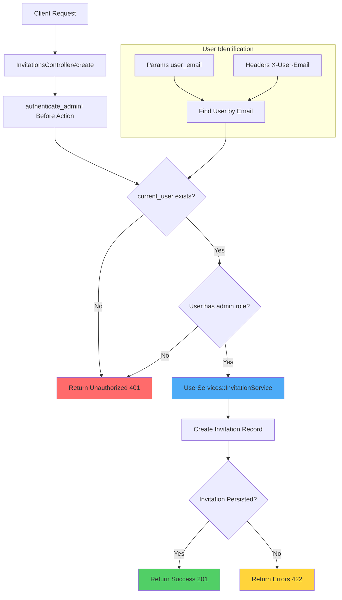
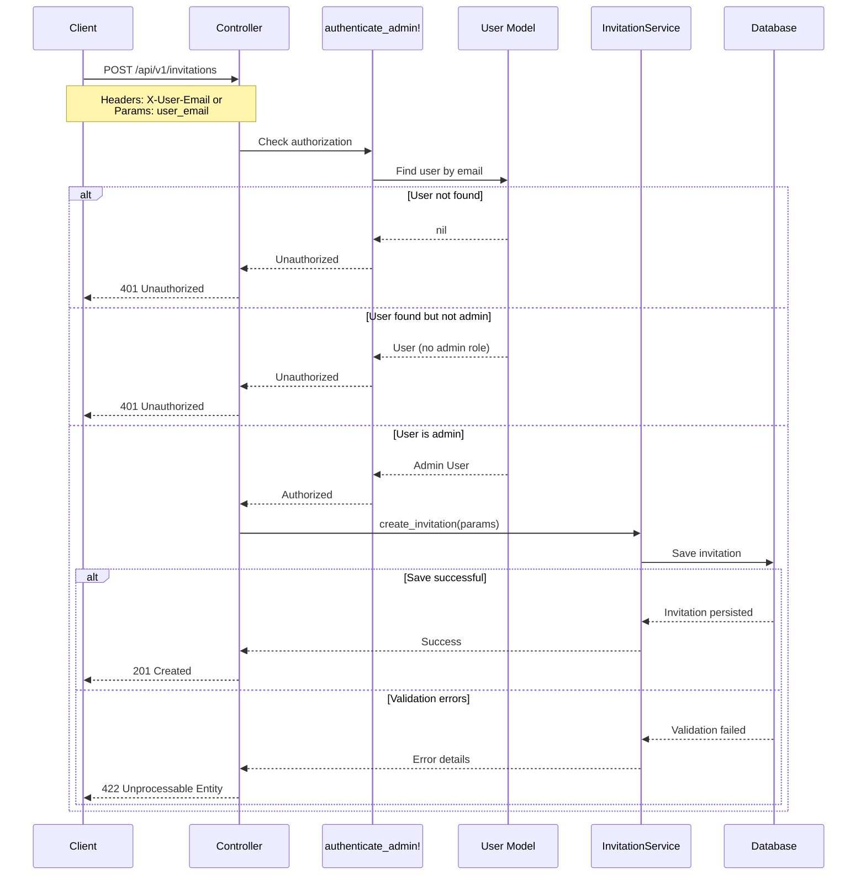
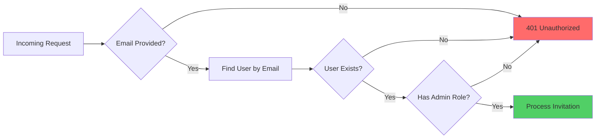
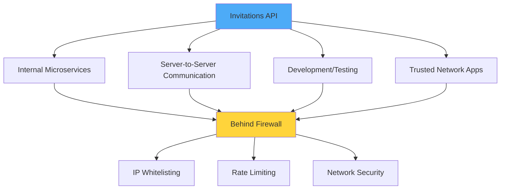
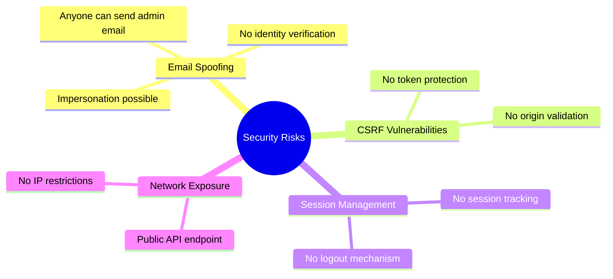
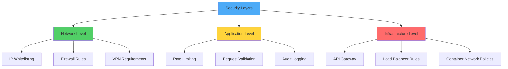
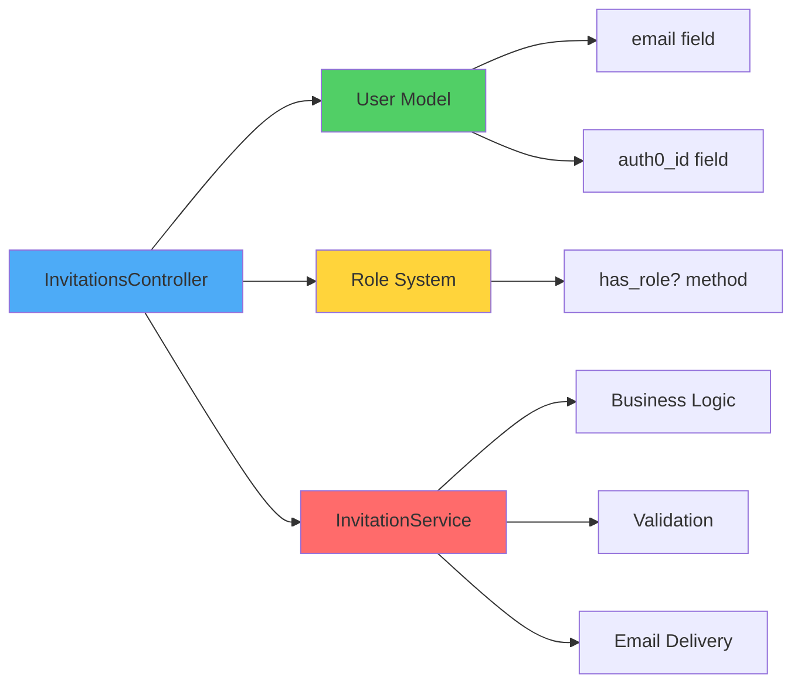
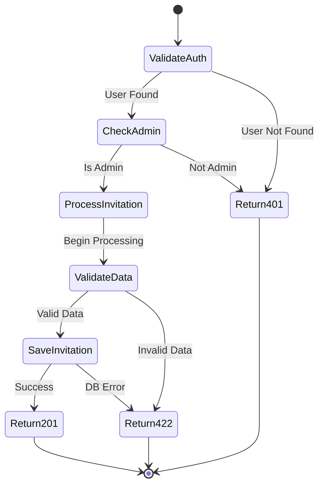

# Invitations Controller - Simplified Version

## 📋 Controller Purpose

This controller handles the creation and sending of invitations to users, specifically designed for internal/admin use cases where full authentication is not required.

## 🔧 Key Features

- **Admin-only access** - Only users with 'admin' role can send invitations
- **Email-based identification** - Users identified by email address without token authentication
- **Invitation service integration** - Delegates business logic to dedicated service class
- **RESTful response handling** - Returns appropriate JSON responses for success/error cases

## 🏗️ Architecture Flow



## 🔄 Complete Request/Response Flow



## 🔐 Security Model

### Current Implementation



### Identification Methods

**Query Parameter:**
```
POST /api/v1/invitations?user_email=admin@school.edu
```

**Request Header:**
```
X-User-Email: admin@school.edu
```

## 🎯 Use Cases

### Intended Environments



### Sample Request

```bash
curl -X POST \
  http://localhost:3000/api/v1/invitations \
  -H 'Content-Type: application/json' \
  -H 'X-User-Email: admin@school.edu' \
  -d '{
    "phone_number": "+1234567890",
    "school_id": "507f1f77bcf86cd799439011"
  }'
```

## ⚠️ Security Considerations

### Risk Assessment



### Mitigation Strategy



### Compensation Strategies

- Use in firewalled environments only
- Implement IP whitelisting at network level
- Add request rate limiting
- Consider API key authentication as minimal protection
- Enable comprehensive audit logging
- Monitor for suspicious patterns

## 🔄 Dependencies



## 📈 Response Examples

### Success (201)
```json
{
  "success": true,
  "message": "Invitation sent successfully."
}
```

### Unauthorized (401)
```json
{
  "success": false,
  "error": "You are not authorized to perform this action."
}
```

### Validation Error (422)
```json
{
  "success": false,
  "errors": ["Phone number is invalid", "School not found"]
}
```

## 📊 Response Status Flow



---

**Note:** This simplified version maintains business logic integrity while removing authentication complexity for specific use cases where security is handled at different layers.