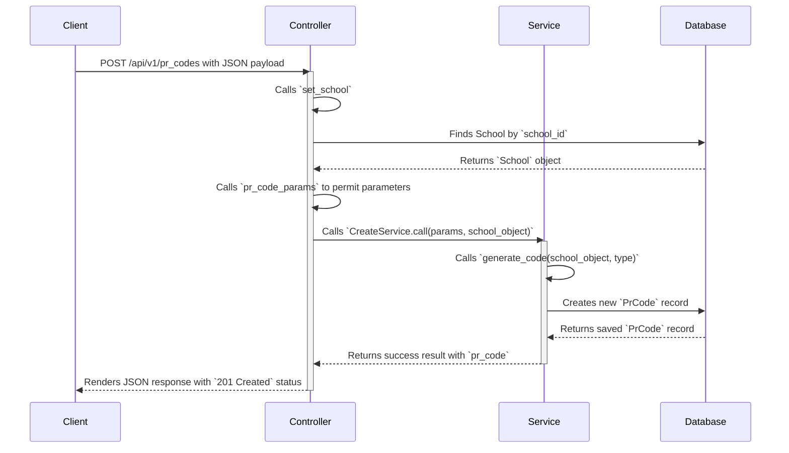

Summary of the PrCodesController
The PrCodesController acts as the entry point for API requests related to PR codes. It follows a standard RESTful pattern, handling requests for creating, listing, showing, and deleting PR codes. Its main responsibilities are:

Request Handling: It receives incoming requests from clients (like the curl command you've been using).

Data Validation: It uses a private method, pr_code_params, to ensure that only permitted parameters (school_id, template_id, channel, recipient_type, invite_id) are passed through, which is a key security measure known as "Strong Parameters."

Delegation to Services: It does not contain complex business logic itself. Instead, it delegates that work to dedicated service objects like PrCodeServices::CreateService and PrCodeServices::DestroyService. This is a best practice that keeps controllers "skinny."

Before Actions: The before_action :set_school is used to find the school record from the database before the create action runs. This is a crucial step to ensure the service has the data it needs.

Response: After the service completes, the controller formats the response as JSON, either with the new PR code and a 201 Created status or with validation errors and a 422 Unprocessable Entity status.

Summary of the PrCodeServices::CreateService
The CreateService is a service object dedicated to handling the business logic for creating a new PR code. Its responsibilities are:

Business Logic: It contains the core logic for generating a new PR code. This includes the logic to format a unique code using the school's name and the recipient type.

Code Generation: It uses a private method, generate_code, to create a unique string (e.g., "SCHOOL2-LEARNER-ABCDEF"). This method relies on the schoolName attribute of the School object passed to it.

Record Creation: It creates a new PrCode record and saves it to the database.

Result Handling: It returns a structured OpenStruct object indicating whether the operation was success? or not, and provides the created PR code or a list of errors.

Flow of the create Request
Here is a diagram showing how the controller and service work together to process your request.

